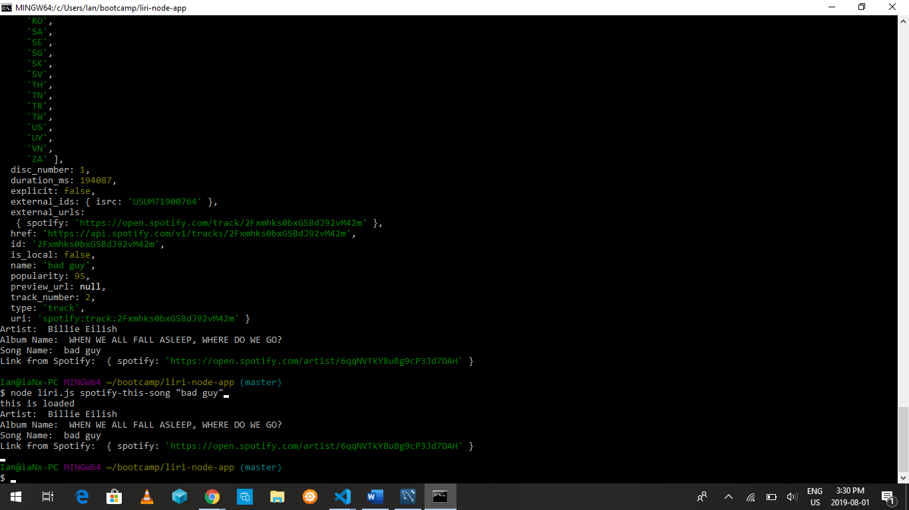

# liri-node-app
* You know Siri? Well Liri is your computer version of Siri! Liri will display your search results and       details. 
* You have the option to choose one of the searches below.

  MOVIES:    
   * Title of the movie.
   * Year the movie came out.
   * IMDB Rating of the movie.
   * Rotten Tomatoes Rating of the movie.
   * Country where the movie was produced.
   * Language of the movie.
   * Plot of the movie.
   * Actors in the movie.

  SONGS: detailing 
    * Artist(s)
    * The song's name
    * A preview link of the song from Spotify 
    * The album that the song is from

  CONCERTS: detailing 
    * Name of the venue
    * Venue location
    * Date of the Event

To search a movie, type in node liri.js movie-this "your movie choice". Your search should look like this.

To search a band playing in town type in node liri.js concert-this "your band choice". Your search should look like this.

To search a song, type in node liri.js spotify-this-song "your song choice". Your search should look like this.

To run a random function, type in node liri.js do-what-it-says. Your search should look like this.

